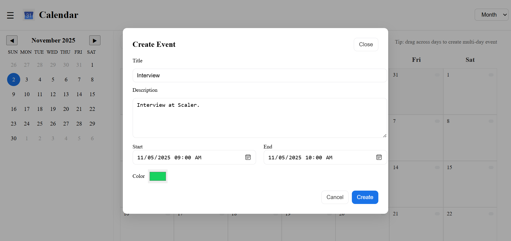
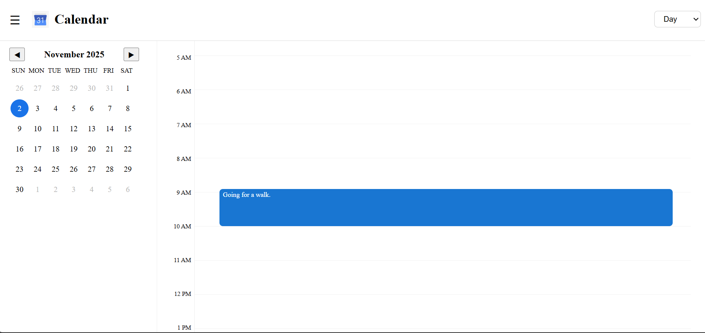
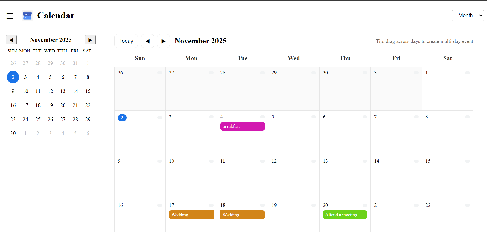

# 📆 Calendar Scheduler

## Overview
This project is a fully functional **calendar scheduler application** built using **React**. It provides users with multiple views — **Month, Week, and Day** — to efficiently manage and visualize their events. The application supports **adding, editing, deleting**, and **viewing events**, all with a modern design inspired by Google Calendar. It includes hover-based tooltips, modal dialogs for event creation, and smooth animations for a polished user experience.

---
## 👁 Preview

### > Modal View


### > Calendar with Day View


### > Calendar with Month View


---

## 🧩 Setup and Run Instructions

### 1. Clone the Repository
```bash
git clone https://github.com/yourusername/react-calendar-scheduler.git
cd react-calendar-scheduler
```

### 2. Install Dependencies
```bash
npm install
```

### 3. Start the Development Server
```bash
npm start
```
This will start the app in development mode and open it automatically in your default browser at `http://localhost:3000`.

### 4. Build for Production
```bash
npm run build
```
This creates an optimized build ready for deployment.

---

## 🏗️ Architecture & Technology Choices

### **1. React (Frontend Framework)**
React was chosen for its **component-based architecture**, making it easy to maintain reusable UI elements such as modals, grids, and event cards.

### **2. Context API (State Management)**
The app uses React’s **Context API** (`EventContext`) to manage global state for events. This eliminates the need for prop drilling and allows any component to access or modify events directly.

### **3. date-fns (Date Manipulation)**
The **date-fns** library provides efficient, lightweight functions for parsing, formatting, and comparing dates (e.g., `format`, `addDays`, `startOfDay`, `parseISO`). It was chosen for its simplicity and modular nature over heavier libraries like Moment.js.

### **4. CSS Modules / Inline Styling**
Each view (Month, Week, Day) has its layout and grid handled using **CSS grid and flexbox**. Modals and hover tooltips are styled using clean inline styles and transitions for clarity and maintainability.

### **5. React-DateTime-Picker**
Used in modals for selecting event start and end times. It integrates seamlessly with date-fns and provides a simple, accessible UI.

---

## ⚙️ Business Logic and Edge Cases

### **1. Event CRUD Operations**
- Users can **create**, **edit**, and **delete** events.
- Events are stored in context and automatically update the UI when modified.

### **2. Time-Based Layout**
- In Day and Week views, events are displayed based on their start and end times.
- Events are positioned dynamically using pixel offsets based on their duration.

### **3. Overlapping Events**
The system detects overlaps visually by layering events using CSS absolute positioning. Although both events can coexist, future enhancements may include side-by-side alignment for better readability.

### **4. Recurring Events**
Currently, recurring events are not natively supported, but the structure allows adding this logic easily by expanding event objects with recurrence rules (e.g., using RRULE standards).

### **5. Edge Case Handling**
- Prevents creation of events without titles or times.
- Ensures `end time > start time` during creation or update.
- Automatically adjusts event rendering on date navigation (next/previous day/week).

---

## ✨ Animations and Interactions

- **Framer Motion** (or CSS transitions) is used for subtle animations when opening and closing modals.
- **Hover effects** on event cards display tooltips showing the event’s title, description, and time.
- The **current time indicator** in the Day view is dynamically updated every minute to highlight the current time visually.
- The **modal expansion** animation improves user engagement and focus.

---

## 🚀 Future Enhancements

Here are some planned or suggested improvements for upcoming versions:

1. **Recurring Event Support:**  
   Implement repeating events (daily, weekly, monthly) using recurrence rules.

2. **Conflict Resolution UI:**  
   Automatically detect and display overlapping events side-by-side for better clarity.

3. **Event Search and Filtering:**  
   Add a search bar and filters (e.g., by date, title, or color category).

4. **Color-Coded Categories:**  
   Group events by type (e.g., work, personal, study) and assign specific colors.

5. **Notifications and Reminders:**  
   Enable browser-based or email notifications for upcoming events.

6. **User Authentication and Sync:**  
   Support multiple users and sync with cloud storage (e.g., Firebase, Google Calendar API).

7. **Drag-and-Drop Events:**  
   Allow users to reschedule events by dragging them to new time slots.

---

## 🧠 Author Notes
This project demonstrates intermediate-to-advanced React concepts, component structuring, state management, and calendar-based UI logic. It’s designed to be scalable and extendable — perfect for portfolio showcases or real-world scheduling systems.

---

### 🪄 Technologies Used
- React
- Context API
- date-fns
- React-DateTime-Picker
- Framer Motion (optional for animations)
- HTML5 / CSS3 / JavaScript (ES6+)

---

## 📁 File Structure

```
backend/
src/
├── components/
│   ├── Day.jsx
│   ├── Week.jsx
│   ├── Month.jsx
│   └── EventModal.jsx
├── context/
│   └── EventContext.jsx
├── App.jsx
├── index.js

```

---

### © 2025 React Calendar Scheduler
Developed with ❤️ using React and 🌍 Deployed using Render:- 🔗[Open Live App](https://mycalendar-qanl.onrender.com)

